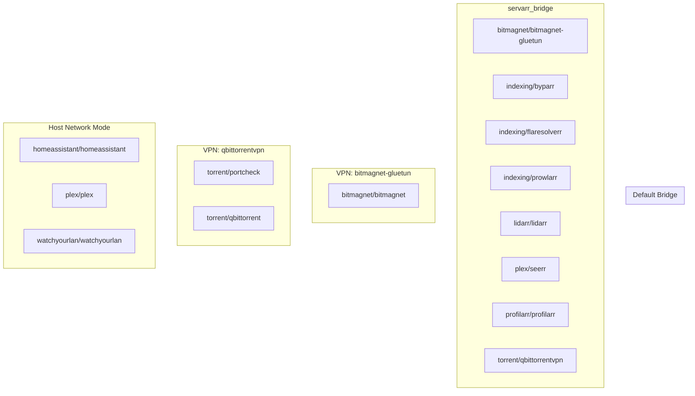

# Saffron Codebase Documentation

## Overview

Saffron is a self-documenting, modular homelab deployment system built on Docker Compose. It provides a collection of pre-configured stacks (media servers, automation, monitoring, etc.) that can be independently managed via the Dockge web UI.

**Key principle:** Everything is static YAML files in git. No special orchestration, no dependency databases—just docker-compose.

## Directory Structure

```
saffron/
├── stacks/                    # Individual service stacks
│   ├── common.yaml.public    # Shared base config template (copied to common.yaml on install)
│   ├── README.md             # Stack index and documentation
│   ├── backrest/             # Example: Restic backup UI
│   │   ├── compose.yaml
│   │   └── README.md
│   ├── servarr/              # Media library management (sonarr/radarr/bazarr/readarr)
│   ├── torrent/              # qBittorrent + VPN (gluetun)
│   ├── [20+ other stacks]
│   └── ...
├── resources/
│   ├── install-saffron.sh   # Setup script (creates dirs, generates common.yaml)
│   ├── remove-saffron.sh    # Cleanup script
│   ├── pre-commit            # Git hook for webp image conversion
│   ├── settings.json         # Dockge UI configuration
│   └── README.md             # Installation guide
├── .github/workflows/
│   └── compose-validate.yml  # GitHub Actions: validates compose files on push
├── compose.yaml              # Root compose file (runs dockge only)
├── index.html                # docsify wiki homepage
├── _navbar.md, _config.yml   # docsify configuration
├── README.md                 # Project readme and "why Saffron" explanation
├── CLAUDE.md                 # This file
└── .gitignore               # Tracks what not to commit (.env, custom stacks, etc.)
```

## How Saffron Works

### Installation Flow

1. User clones the repo and runs `install-saffron.sh`
2. Script creates `/containers/` (for config) and asks for `$DATA_DIR` (for media)
3. Script generates `stacks/common.yaml` from `stacks/common.yaml.public`, substituting `$DATA_DIR`
4. Root `compose.yaml` starts only the **dockge** container
5. User accesses dockge UI (`:5001`) and manually starts desired stacks

### Stack Organization

Each stack is a **separate docker-compose project**:

- **Standalone service** (heimdall, gotify, watchtower): single container in its own compose file
- **Multi-container stack** (servarr, torrent, bitmagnet): multiple related services networked together

Dockge displays each stack directory as a separate "project" and allows start/stop/update via UI.

### Shared Configuration (common.yaml)

`stacks/common.yaml.public` defines:

```yaml
services:
  base-settings:
    environment:
      - PGID=1000
      - PUID=1000
      - UMASK=022
    volumes:
      - /etc/localtime:/etc/localtime:ro
  media-access:
    extends: base-settings
    volumes:
      - /data/tv:/data/tv # (populated from $DATA_DIR at install)
      - /data/movies:/data/movies
      # ... etc
```

Most stacks extend one of these base services to inherit consistent:

- User/group IDs (media lib permissions)
- Timezone
- Data directory mounts

**Why not centralize?** If common.yaml broke, every stack would fail. This design keeps each stack independent but consistent.

### Network Architecture

- **Default bridge** (`saffron_default`): Most services communicate internally via container names
- **External bridges** (`servarr_bridge`, etc.): Multi-stack communication (e.g., torrent → servarr)
- **Host mode** (plex, homeassistant, watchyourlan): Direct network access (special cases)
- **VPN routing** (torrent, bitmagnet + slskd): Services tunnel through gluetun (wireguard)

### Network Topology Diagram



**Key relationships:**

- **servarr_bridge**: Connects indexing (prowlarr, flaresolverr, byparr), media management (radarr, sonarr, lidarr), and download clients (qbittorrent, bitmagnet)
- **bitmagnet-gluetun**: Isolated VPN for bitmagnet (DHT crawler) and slskd (file sharing)
- **qbittorrentvpn**: Isolated VPN for torrent client (qBittorrent) and port-checker
- **Host mode**: Services requiring direct host network access (plex transcoding, homeassistant integrations, network scanning)

To regenerate this diagram after adding/removing stacks, run:

```bash
python3 resources/generate-topology.py > /tmp/topology.mermaid
# Compare output with diagram above, update CLAUDE.md if topology changed
```

## Key Files & Their Purpose

### compose.yaml

Root compose file. Runs **only dockge** (the web UI).

- **Why separate from stacks?** Dockge manages stacks/ directories, so it can't be in a stack directory without conflict.

### stacks/README.md

Wiki index of all 21 stacks. Alphabetized list with one-line descriptions and links to per-stack READMEs.

- Automatically published via docsify as the project's public wiki
- Must be kept in sync with actual `stacks/` directories (CI checks this)

### stacks/[name]/README.md

Per-stack documentation: project links, architecture compatibility badges, docker info.

- Enables the "self-documenting" claim
- Also published via docsify

### stacks/[name]/.env.public

**Template** for required environment variables (credentials, URLs, etc.)

- Not secret; committed to git
- Users copy to `.env` (which is gitignored) and fill in values
- Optional; only needed if stack uses env vars

### resources/install-saffron.sh

Setup automation:

1. Creates `/containers/` directory structure
2. Prompts for `$DATA_DIR` (bulk media storage location)
3. Generates `stacks/common.yaml` by interpolating `$DATA_DIR` into `common.yaml.public`
4. Starts dockge

**Critical bug fixed:** Previously line 32 used `>` (overwrite) instead of appending, losing the entire common.yaml template.

### .github/workflows/compose-validate.yml

GitHub Actions CI:

- Validates each stack's compose file syntax
- Checks every stack directory has a README.md
- Verifies compose version and pull_policy presence
- Runs on push/PR to stacks/ directory

## Architecture Decisions

### Static YAML, No Orchestration

- ✓ Simple: easy to understand, fork, modify
- ✓ Git-friendly: version history, diffs, rollbacks
- ✗ Manual: no automatic scaling, no self-healing
- **Trade-off:** Suits homelabs (static topology, manual ops preferred)

### One Compose File Per Stack

- ✓ Independent deployment and updates
- ✓ Clear separation of concerns
- ✓ Survives if one stack's compose breaks
- ✗ Can't easily orchestrate cross-stack startup order
- **Trade-off:** Uses `depends_on` within stacks; cross-stack needs manual ordering in UI

### Extends Pattern for Shared Config

- ✓ DRY (don't repeat PUID/timezone in 20 files)
- ✓ Survives if one service breaks extends target
- ✗ Extends can't override individual volumes, so each stack still repeats some boilerplate
- **Trade-off:** Good enough for the consistency level needed

### pull_policy: missing for pinned, always for floating

- **Pinned services** (profilarr, byparr, homeassistant, indexing, torrent, servarr, etc.) use `pull_policy: missing` — skip re-pull if image tag already present locally. Watchtower handles intentional updates.
- **Floating-tag services** (portcheck, which has no semver tags) use `pull_policy: always` — necessary when upstream only publishes `:latest`.
- ✓ Avoids re-pulling same digest on every restart (efficiency)
- ✓ Explicit version pins prevent surprise breakage from upstream releases
- See commit 532cba4 for full hardening pass (2026-08-16)

### Separate Data Directory ($DATA_DIR)

- `/containers/` = config (linked to git projects, small)
- `$DATA_DIR` = media (unlinked, hundreds of GB)
- ✓ Easy to move media between machines
- ✓ Clear separation for backups
- **By user choice:** Not enforced; could mount anything

## Contributing & Extending

### Adding a New Stack

1. Create `stacks/newstack/compose.yaml`
2. Follow existing patterns:
   - `version: "3.8"` at top
   - `container_name` matches service name
   - `extends: ../common.yaml` if using linuxserver images
   - `pull_policy: always` for each image
   - `networks: {}` at bottom
3. Create `stacks/newstack/README.md` with:
   - One-line description
   - Links to upstream project
   - Architecture compatibility badges (if multi-arch)
   - Docsify include of compose.yaml
4. If stack needs config, create `stacks/newstack/.env.public`
5. Add entry to `stacks/README.md` (alphabetical)
6. Push; CI validates automatically

### Modifying Existing Stack

- Compose changes: update `stacks/[name]/compose.yaml`
- Config changes: document in `.env.public`, don't commit `.env`
- README updates: keep in sync with actual services
- CI runs on push; failures block merge

### Testing Changes Locally

```bash
# Validate one compose file
docker compose -f stacks/servarr/compose.yaml config

# Start a stack via dockge UI after docker-compose is running
# Or manually:
cd stacks/servarr
docker compose up -d
```

## Common Tasks

### Deploy Saffron

```bash
git clone https://github.com/ivylikethevine/saffron.git
cd saffron/resources
./install-saffron.sh
# Then visit http://localhost:5001
```

### Add a Credential to a Stack

```bash
cd stacks/torrent
cp .env.public .env
# Edit .env with your VPN credentials
docker compose up -d
```

### Mirror Saffron Setup to Another Machine

```bash
# On machine A: git push (all config)
# On machine B:
git clone ...
cd resources
./install-saffron.sh    # sets up /containers and common.yaml
# Then manually start stacks from dockge UI
```

### Fork Saffron for Custom Stacks

```bash
# Keep saffron stacks, add your own
mkdir stacks/p-custom
# create compose.yaml inside
# 'p-' prefix means git ignores it (see .gitignore)
```

## Performance & Scaling

- **CPU:** Most stacks are I/O-bound (disk, network); 2-4 cores sufficient
- **RAM:** Lightweight; typically use 4-8 GB for a full setup
- **Disk:** Depends on media; `/containers/` is ~1 GB, `$DATA_DIR` is unbounded
- **Network:** Local only (no public exposure built-in); VPN via gluetun is opt-in

Saffron scales by **adding stacks**, not by replicating existing ones. No load balancing or clustering.

## Security Considerations

### Secrets Management

- Never commit `.env` files; `.gitignore` enforces this
- `.env.public` templates document what's needed, not actual values
- Consider git-crypt or bitwarden for shared credentials across team

### Network Exposure

- By default, all services bind to `localhost` (not `0.0.0.0`)
- Services accessible only within docker network or via port mappings
- VPN services (bitmagnet, torrent) tunnel traffic through external VPN
- No TLS termination built-in; use reverse proxy if exposing to internet

### Image Provenance

- `pull_policy: always` ensures latest versions on start
- linuxserver.io images are widely trusted, but audit before using others
- No image signing/verification; consider adding in future if needed

## Troubleshooting

### Compose file fails to start

- Run `docker compose -f stacks/[name]/compose.yaml config` to check syntax
- Check CI workflow passed (green checkmark on GitHub)

### Stack won't start: "Can't connect to servarr_bridge"

- Manually create the bridge: `docker network create servarr_bridge`
- Or start one stack that defines it first (e.g., servarr)

### /containers directory doesn't exist

- Run `install-saffron.sh` again, or manually: `sudo mkdir -p /containers && sudo chown 1000:1000 /containers`

### Dockge won't start: "docker.sock permission denied"

- User may not be in docker group: `sudo usermod -aG docker $USER && newgrp docker`

## Future Improvements

See [ROADMAP.md](ROADMAP.md) for the full prioritized list (pinned versions,
healthchecks, resource limits, reverse proxy/TLS, secrets management, and
more).
