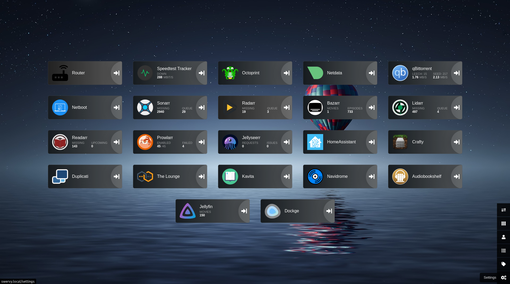

# Saffron



## (S)erver (A)s a (F)ile (F)older (R)unning (O)n (N)etwork

...the second half is a backcronym

### Saffron is a docker compose implementation of a server deployable via (almost entirely) static files

#### To deploy

```bash
ssh <hostname>.local
git clone git@github.com:ivylikethevine/saffron.git
cd saffron/dockge
docker compose up -d
```

then visit localhost:5001  or \<hostname\>.local:5001 to start and stop individual stacks via the [Dockge](https://github.com/louislam/dockge) interface. Dockge is a Web UI to manage & control docker containers. As opposed to portainer, the user maintains direct and full control of the compose yaml files.

## v0.1 List of Stacks & Services

&#x2705;: Tested

&#128679;: Active development

- &#128679; [crafty](https://docs.craftycontrol.com/pages/getting-started/installation/docker/) - minecraft servers
- &#x2705; [duplicati](https://docs.linuxserver.io/images/docker-duplicati/) - backup to AWS/Backblaze/etc.
- &#x2705; [heimdall](https://docs.linuxserver.io/images/docker-heimdall/) - home page
- &#x2705; [homeassistant](https://www.home-assistant.io/installation/linux#docker-compose) - smart home automation
- media-clients
  - &#x2705; [jellyfin](https://docs.linuxserver.io/images/docker-jellyfin/) - tv/movie streaming
  - &#x2705; [jellyseer](https://hub.docker.com/r/fallenbagel/jellyseerr) - media requests
  - &#x2705; [kavita](https://github.com/Kareadita/Kavita) - ebook reader
  - &#x2705; [navidrome](https://github.com/navidrome/navidrome/) - music streaming
  - &#x2705; [audiobookshelf](https://github.com/advplyr/audiobookshelf) - audiobook streaming
- &#x2705; [netboot](https://docs.linuxserver.io/images/docker-netbootxyz/) - PXE boot system
- &#x2705; [netdata](https://learn.netdata.cloud/docs/installing/docker) - hardware usage/monitoring (incl. containers)
- &#128679; [octoprint](https://github.com/OctoPrint/octoprint-docker) - 3D printer automation/monitoring
- torrent - torrent client + indexing (required for servarr) & cloudflare resolver
  - &#x2705; [qbittorrentvpn](https://github.com/MarkusMcNugen/docker-qBittorrentvpn) - torrent client that runs only on VPN connection
  - &#x2705; [prowlarr](https://docs.linuxserver.io/images/docker-prowlarr/) - search aggregator
  - &#x2705; [flaresolverr](https://github.com/FlareSolverr/FlareSolverr) - search proxy (required for some search engines)
- [servarr](https://wiki.servarr.com/docker-guide) - media library system
  - &#x2705; [sonarr](https://docs.linuxserver.io/images/docker-sonarr/) - tv
  - &#x2705; [radarr](https://docs.linuxserver.io/images/docker-radarr/) - movies
  - &#x2705; [lidarr](https://docs.linuxserver.io/images/docker-lidarr/) - music
  - &#x2705; [readarr](https://docs.linuxserver.io/images/docker-readarr/) - ebooks
  - &#x2705; [bazarr](https://docs.linuxserver.io/images/docker-bazarr/) - subtitles for movies/tv
- &#x2705; [speedtest-tracker](https://github.com/alexjustesen/speedtest-tracker) - internet speed monitoring
- &#128679; [thelounge](https://github.com/thelounge/thelounge-docker) - IRC client
- &#128679; [traefik](https://hub.docker.com/_/traefik) - reverse proxy
- &#128679; [uptime-kuma](https://github.com/louislam/uptime-kuma) - nice health checking tool (same dev as Dockge!)
- &#x2705; [watchtower](https://github.com/containrrr/watchtower) - automatically update & restart docker containers

### Compatible with

- [obico](https://www.obico.io/docs/server-guides/install/) - 3D print failure detection notification/stopping
  - To install:
    `cd /home/${USER}/saffron/stacks && git clone -b release https://github.com/TheSpaghettiDetective/obico-server.git && cd obico-server && docker compose up -d`

#### Easy docker install

`curl -fsSL https://get.docker.com -o get-docker.sh && sudo sh ./get-docker.sh`

** Note: If installing on Linux Mint, `$VERSION_CODENAME` needs to be replaced with `$UBUNTU_CODENAME` for the apt sources to be correct

#### Docker Volumes

When editing the DATA_DIR(s), it is often best to have the last part of the host volume match the container volume, such as:

- `/data/television/:/local/library/television` -> Intuitive
- `/data/tv/:/local/library/television` -> Often confusing (at least for me!)

#### Migration Tools

- [composerize](https://github.com/composerize/composerize) - to turn `docker run...` into docker compose yaml (though dockge does have an implementation of this in the UI)
- [decomposerize](https://github.com/composerize/decomposerize) - inverse of above
- [autocompose](https://github.com/Red5d/docker-autocompose) - to turn running containers into docker compose yaml

##### Useful Bash Commands

Quick & dirty fix for fixing file permissions: `sudo chown -R 1000:1000 dirName`

##### Internal Routing

For configuring docker containers that talk to each other, you can replace `localhost` with the `container_name` of the service to network with. For example, connecting prowlarr & sonarr, you can use `prowlarr:9696` and `sonarr:8989`. If the containers are not in the same stack, this will require a bridge connection. An example of a bridge is included in `servarr` and `torrent`.

##### Env Files

This project has two types of `.env` files:

1. `.env` - this type is natively loaded by dockge, allowing for Web UI editing + templating for paths. This is the place that VPN credentials, etc. should be stored since they will not be committed.
    - if stacks throw errors about undefined variables, make sure to define those variables in the `.env` for that stack.
    - these files are ignored by git, so they can locally hold some credentials (such as VPN logins) + personal folder routing
2. `.env.public` - this holds basic preconfigurations for each container to work and should be changed with caution. They are not available in the Dockge Web UI.

#### To-Do

- Test dockge multiple node system
- Netdata streaming between nodes
- Add traefik autorouting
- Add uptime/monitoring
- Test easy docker install on linux mint
- Describe folders: /containers/, /home/user/saffron, + DATA_DIR
- DNS description (avahi, .local, mdns)
- Add avahi-repeater
- Services:
  - Adguard-home
  - Code-server
  - Ansible
  - Mail server
  - Cloudflare
  - Nextcloud
