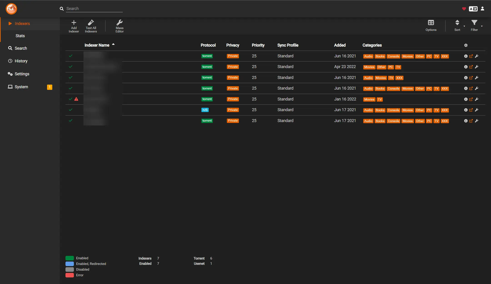
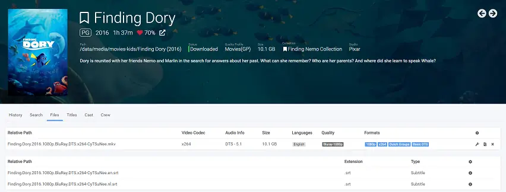
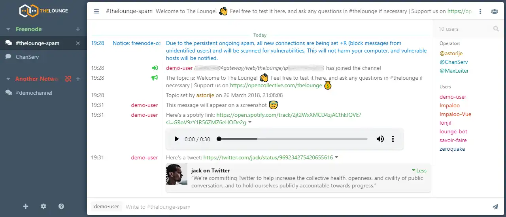

# Saffron

    

## (S)erver (A)s a (F)ile (F)older (R)unning (O)n (N)etwork

...the second half is a backcronym

### Saffron is a docker compose implementation of a server deployable via (almost entirely) static files

[Why Saffron?](https://ivylikethevine.com/projects/saffron)

I built saffron because I wanted a way to utilize docker compose on a homelab server with easy SVM, configurability, and simple setup.

#### Features

- Media libraries for TV, movies, music, ebooks, & audiobooks. (+ subtitles!)
- Easy migration from any existing docker or docker compose deployment.
- Full torrenting suite with VPN integration.
- Automated backup to cloud storage.
- Smart home automation & integration.
- Network speedtests + hardware monitoring.
- Minecraft server hosting.
- PXE environment for OS booting on other nodes.
- Zero DNS or networking configuration outside of docker.

##### Features (Under Development)

1. Automatic traefik routing of containers using docker integration.
1. Netdata streaming between nodes.
1. Dockge multi-node deployment support.
1. Git submodules/subtrees for additional services.
1. SSL certs

#### To deploy

Requires: git, docker, docker compose

```bash
# Grab saffron
git clone git@github.com:ivylikethevine/saffron.git
cd saffron

# Create file paths with correct permissions & start dockge
./install-saffron.sh
```

##### Easy installation of git & docker

```bash
sudo apt install -y git # required to install saffron
sudo apt install -y avahi-daemon # optional, but highly recommended for easy configuration

# Install docker from the easy install script
curl -fsSL https://get.docker.com -o get-docker.sh && sudo sh ./get-docker.sh

# Allow docker to run without sudo
sudo usermod -aG docker $USER
newgrp docker
# And verify
docker run hello-world
```

Then visit `http://localhost:5001` or `http://<hostname>.local:5001` to start and stop individual stacks via the [Dockge](https://github.com/louislam/dockge) interface. Dockge is a Web UI to manage & control docker containers. As opposed to portainer, the user maintains direct and full control of the compose yaml files.

##### To Update

```bash
docker stop $(docker ps -a -q)  # Important to stop before updates!
cd /home/$USER/saffron
git pull
docker compose up -d dockge # Then visit dockge to start/stop containers
```

#### To Remove

```bash
cd /home/$USER/saffron
./remove-saffron.sh
```

### Important Paths

1. `/containers/` - stores individual generated configs, db files, etc.
    - This is not a perfect separation, since some containers will use config for "data" (such as torrent clients using it as a default download location)
2. `/home/$USER/saffron` - saffron root `/dockge` - dockge, `/stacks` - all other stacks/services
3. `$DATA_DIR` - where bulk files are stored (documents, photos, media, etc.) per stack.
    - `.env` files are not (currently) shared between any stacks, so each `.env` must define `DATA_DIR` per stack

## v0.20 List of Stacks & Services

** Names are lowercased per dockge stack naming requirements

&#x2705;: Tested

&#128679;: Active development

- &#128679; [avahi](https://github.com/flungo-docker/avahi) - Allows docker containers to access mdns on LAN.
  - <details>
      <!-- <h3>WebUI Dashboard</h3> -->
      <!--  -->

      
      
    </details>

- &#128679; [crafty](https://docs.craftycontrol.com/pages/getting-started/installation/docker/) - Easily deploy/manage minecraft servers.
  - <details>
      <!-- <h3>WebUI Dashboard</h3> -->
      <!--  -->

      
      
    </details>

- &#128679; [dokemon](https://dokemon.dev/) - Web UI to manage docker containers/view logs/etc.
  - <details>
      <!-- <h3>WebUI Dashboard</h3> -->
      <!--  -->

      
      
    </details>

- &#x2705; [dockge](https://github.com/louislam/dockge) - Web UI to manage docker compose files (integral to `saffron`).
  - <details>
      <h3>WebUI Dashboard</h3>
      

      
      
    </details>

- &#x2705; [duplicati](https://docs.linuxserver.io/images/docker-duplicati/) - Automated backup to AWS/Backblaze/etc.
  - <details>
      <h3>WebUI Dashboard</h3>
      
      <h4>Example implementation on <a href="https://ivylikethevine.com/projects/homelab-backups/#rule-3-offsite-backups">my blog.</a></h4>

      
      
    </details>

- &#128679; [handbrake](https://handbrake.fr/) - Web UI for transcoding video/audio files.
  - <details>
      <!-- <h3>WebUI Dashboard</h3> -->
      <!--  -->

      
      
    </details>

- &#x2705; [heimdall](https://docs.linuxserver.io/images/docker-heimdall/) - Easy to use home page.
  - <details>
      <h3>WebUI Dashboard</h3>
      

      
      
    </details>

- &#x2705; [homeassistant](https://www.home-assistant.io/installation/linux#docker-compose) - Smart home automation.
  - <details>
      <h3>WebUI Dashboard</h3>
      

      
      
      <!--  HA is unable to use the /v/ version badge for some reason. -->
    </details>

- media-clients - Various media streaming services with a preconfigured <a href="https://github.com/ivylikethevine/saffron/blob/main/stacks/media-clients/.env.public"><code>.env.public</code></a>.

  - &#x2705; [jellyfin](https://docs.linuxserver.io/images/docker-jellyfin/) - TV/movie streaming.
    - <details>
        <h3>WebUI Dashboard</h3>
        
        <h4>This container implements the Intel Quicksync hardware encoding, but others are configurable as per <a href="https://docs.linuxserver.io/images/docker-jellyfin/#hardware-acceleration-enhancements">jellyfin acceleration</a> and <a href="https://mods.linuxserver.io/?mod=jellyfin"> linuxserver's docker mods</a>.</h4>

        
        
      </details>

  - &#x2705; [jellyseerr](https://hub.docker.com/r/fallenbagel/jellyseerrr) - TV/movie requests.
    - <details>
        <h3>WebUI Dashboard</h3>
        

        
        
      </details>

  - &#x2705; [kavita](https://github.com/Kareadita/Kavita) - Ebook reader.
    - <details>
        <h3>WebUI Dashboard</h3>
        

        
        
      </details>

  - &#x2705; [navidrome](https://github.com/navidrome/navidrome/) - Music streaming service.
    - <details>
        <h3>WebUI Dashboard</h3>
        
        <h4>Implements <a href="https://www.subsonic.org/pages/features.jsp">subsonic</a> for compatibility with other services.</h4>

        
        
      </details>

  - &#x2705; [audiobookshelf](https://github.com/advplyr/audiobookshelf) - Audiobook streaming.
    - <details>
        <h3>WebUI Dashboard</h3>
        

        
        
      </details>

- &#x2705; [netboot](https://docs.linuxserver.io/images/docker-netbootxyz/) - PXE boot system.
  - <details>
      <h3>WebUI Dashboard</h3>
      

      
      
    </details>

- &#x2705; [netdata](https://learn.netdata.cloud/docs/installing/docker) - Hardware usage/monitoring (incl. containers).
  - <details>
      <h3>WebUI Dashboard</h3>
      

      
      
    </details>

- &#128679; [octoprint](https://github.com/OctoPrint/octoprint-docker) - 3D printer automation/monitoring
  - <details>
      <h3>WebUI Dashboard</h3>
      

      
      
    </details>

- torrent - Full torrenting suite with a preconfigured <a href="https://github.com/ivylikethevine/saffron/blob/main/stacks/media-clients/.env.public"><code>.env.public</code></a>.
  
  - &#x2705; [qbittorrentvpn](https://github.com/markusmcnugen/docker-qbittorrentvpn) - torrent client that runs only on VPN connection.
    - <details>
        <h3>WebUI Dashboard</h3>
        

        <h4>
          <a href="https://github.com/markusmcnugen/docker-qbittorrentvpn?tab=readme-ov-file#environment-variables">Documentation on Environment Variables</a>
        </h4>

        
        
      </details>
  
  - &#x2705; [prowlarr](https://docs.linuxserver.io/images/docker-prowlarr/) - Search aggregator.
    - <details>
        <h3>WebUI Dashboard</h3>
        

        
        
      </details>
  
  - &#x2705; [flaresolverr](https://github.com/flaresolverr/flaresolverr) - Search proxy (required for some search engines).
    - <details>
      <!-- <h3>WebUI Dashboard</h3> -->
      <!--  -->

      
      
    </details>

- [servarr](https://wiki.servarr.com/docker-guide) - Media library system(s) with a preconfigured <a href="https://github.com/ivylikethevine/saffron/blob/main/stacks/servarr/.env.public"><code>.env.public</code></a>.

  - &#x2705; [sonarr](https://docs.linuxserver.io/images/docker-sonarr/) - TV library manager.
    - <details>
        <h3>WebUI Dashboard</h3>
        

        
        
      </details>

  - &#x2705; [radarr](https://docs.linuxserver.io/images/docker-radarr/) - Movie library manager.
    - <details>
        <h3>WebUI Dashboard</h3>
        

        
        
      </details>

  - &#x2705; [lidarr](https://docs.linuxserver.io/images/docker-lidarr/) - Music library manager.
    - <details>
        <h3>WebUI Dashboard</h3>
        

        
        
      </details>

  - &#x2705; [readarr](https://docs.linuxserver.io/images/docker-readarr/) - Ebook library manager.
    - <details>
        <h3>WebUI Dashboard</h3>
        

        
        
      </details>

  - &#x2705; [bazarr](https://docs.linuxserver.io/images/docker-bazarr/) - Subtitle management/requests for sonarr/radarr.
    - <details>
        <h3>WebUI Dashboard</h3>
        

        
        
      </details>

- &#x2705; [speedtest-tracker](https://github.com/alexjustesen/speedtest-tracker) - Internet speed monitoring.
  - <details>
        <h3>WebUI Dashboard</h3>
        
        <p>TODO: Transition to <a href="https://hub.docker.com/r/linuxserver/speedtest-tracker">linuxserver image</a> and add shield badges.</p>
        Bundled Postgress Versions:
        
        
      </details>

- &#128679; [thelounge](https://github.com/thelounge/thelounge-docker) - IRC client.
  - <details>
      <!-- <h3>WebUI Dashboard</h3> -->
      <!--  -->

      
      
    </details>

- &#128679; [traefik](https://hub.docker.com/_/traefik) - Reverse proxy with easy docker integration.
  - <details>
      <!-- <h3>WebUI Dashboard</h3> -->
      <!--  -->

      
      
    </details>

- &#128679; [tdarr](https://github.com/HaveAGitGat/Tdarr) - Additional Web UI for transcoding video/audio files, with ability to use distributed compute nodes.
  - <details>
      <!-- <h3>WebUI Dashboard</h3> -->
      <!--  -->

      
      
    </details>

- &#128679; [uptime-kuma](https://github.com/louislam/uptime-kuma) - Nice health checking tool with simple UI (same dev as Dockge!).
  - <details>
      <!-- <h3>WebUI Dashboard</h3> -->
      <!--  -->  

      
      
    </details>

- &#x2705; [watchtower](https://github.com/containrrr/watchtower) - Automatically update & restart docker containers.
  - <details>
      <!-- <h3>WebUI Dashboard</h3> -->
      <!--  -->

      
      
    </details>

### Services under consideration

- [Adguard](https://adguard.com/en/welcome.html) - for whole home ad blocking.
- [Ansible Semaphore](https://www.semui.co/) - for easier host updating/management.
- Mail Server - for notifications.
- [Cloudflare](https://developers.cloudflare.com/cloudflare-one/) - for access outside of home network.
- [Nextcloud](https://nextcloud.com/) - for general homelab "cloud".

If a service isn't on here yet, feel free to add it! Most of these are very simple applications of the excellent [linuxserver docker images](https://docs.linuxserver.io/images/). See creating a [saffron-styled compose](#saffron-example) for more detail on the format of `compose.yaml` and `.env.public`.

I've also made stacks using Lissy93's well maintained [portainer template repo](https://github.com/Lissy93/portainer-templates), although this is slightly different than working from raw compose files.

### Compatible with

- [obico](https://www.obico.io/docs/server-guides/install/) - 3D print failure detection notification/stopping
  - To install:
    `cd /home/${USER}/saffron/stacks && git clone -b release https://github.com/TheSpaghettiDetective/obico-server.git && cd obico-server && docker compose up -d`

- For other projects that use a docker compose file from locally build Dockerfiles, clone the repo into `/home/${USER}/saffron/stacks`, then add `stacks/repoName/` to the `.gitignore` file. An alternative is to use either the `p-` or `dev-` prefix in the stack name to be ignored by git. See [editing .gitignore](https://git-scm.com/book/en/v2/Git-Basics-Recording-Changes-to-the-Repository#_ignoring) for more information.

#### Docker Volumes

When editing the DATA_DIR(s), it is often best to have the last part of the host volume match the container volume, such as:

- `/data/television/:/local/library/television` -> Intuitive
- `/data/TV/:/local/library/television` -> Often confusing (at least for me!)

I have `DATA_DIR`, `DATA_DIR_EXTRA`, and `BULK_DIR`, but only `DATA_DIR` is required. The others can be deleted from compose files.

#### Migration Tools

- [composerize](https://github.com/composerize/composerize) - to turn `docker run...` into docker compose yaml (though dockge does have an implementation of this in the UI)
- [decomposerize](https://github.com/composerize/decomposerize) - inverse of above
- [autocompose](https://github.com/Red5d/docker-autocompose) - to turn running containers into docker compose yaml

##### Internal Routing

For configuring docker containers that talk to each other, you can replace `localhost` with the `container_name` of the service to network, as long as both are inside of the same `compose.yaml`. For example, connecting prowlarr & sonarr, you can use `prowlarr:9696` and `sonarr:8989`. If the containers are not in the same stack, this will require a bridge connection. An example of a bridge is included in `servarr` and `torrent`. To connect to `servarr` from `torrent`, `qbittorrenTVpn` must use the `servarr_bridge` network.

##### Env Files

This project has two types of `.env` files:

1. `.env` - this type is natively loaded by dockge, allowing for Web UI editing + templating for paths. This is the place that VPN credentials, etc. should be stored since they will not be committed.
    - if stacks throw errors about undefined variables, make sure to define those variables in the `.env` for that stack.
    - these files are ignored by git, so they can locally hold some credentials (such as VPN logins) + personal folder routing
2. `.env.public` - this holds basic preconfigurations for each container to work and should be changed with caution. They are not available in the Dockge Web UI.

### Creating a Saffron-Styled compose from Scratch <a id="saffron-example"></a>

Saffron is designed to be extensible. It is more an amalgamation of my experience than a specific software suite. As such, here is a compilation of my advice when creating new docker compose files for use with saffron or similar deployments.

1. Only edit in one mode at a time - Implemented in this repository is a vscode server, which allows for editing of files that dockge does not display in the UI (such as `.env.public`, `.gitignore`, and the dockge `compose.yaml`). Using dockge to edit some files & vscode to edit others can often result in mismatches and confusion. For any operation, pick one tool and use that until you can fully transition to the other tool.
2. Keep secrets in `.env` and double check your commits! An alternative option is [docker secrets](https://docs.docker.com/compose/use-secrets/), but same rules apply. Make sure your commits never contain private keys, etc.
3. Consistent naming - In the homelab space, some of the more advanced features of docker are not as useful and often lead to confusion. Here is an example format for a compose file, with explanations. Also, [here is the compose documentation](https://docs.docker.com/compose/compose-file/05-services/).

- It is often easiest to name the stack  after the main service in the compose file.
    

#### stacks/vscode-server/compose.yaml

  ```yaml
  version: 3
  services:
    vscode-server: 
      # "vscode-server" is the name of our service.
      restart: unless-stopped 
      # Always remember to define a restart policy. 
      container_name: vscode-server 
      # Usually easiest to keep as exact duplicate of service name.
      image: linuxserver/code-server 
      # Typically, the service name would be derived from the image name (the part after the "/"). Here, it is different to be easier for human readability since "code-server" is quite vague.
      ports:
        - 8445:8443 
        # The port assignments in saffron are designed to avoid conflicts. host:container is the format, and it is easiest to change host mapping by itself, and not to mess with default port mappings. Some containers require environment variables to change the internal port, so its best to avoid.
      environment:
        - PUID=1000 
        - PGID=1000
        # Most of the time, we want our containers to have the default user permissions (1000:1000 user:group)
      env_file:
        - .env.public 
        # Alternatively to the environment tag, we can load a .env file directly. The above PUID/PGID could be moved to .env.public for conciseness. 
      volumes:
        - /containers/vscode-server/config:/config 
        # Again, usually easiest to follow /containers/container_name/folder:/folder for consistency & clarity.
        - /etc/timezone:/etc/timezone:ro 
        # This will set our TZ to the host's TZ, instead of configuring per container. To change, run `dpkg-reconfigure tzdata` on the host.
  networks: {}
  ```

#### stacks/vscode-server/.env.public

```bash
## Defaults
PGID=1000
PUID=1000
# The PGID/PUID are required in the .env(s), user: 1000:1000 in docker compose does not play well with these images.
UMASK=022
# Relatively safe file permission for containers.
```
