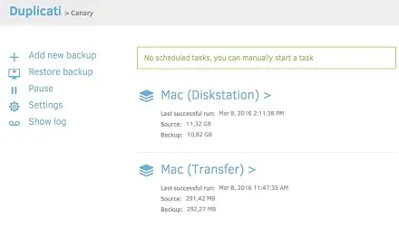
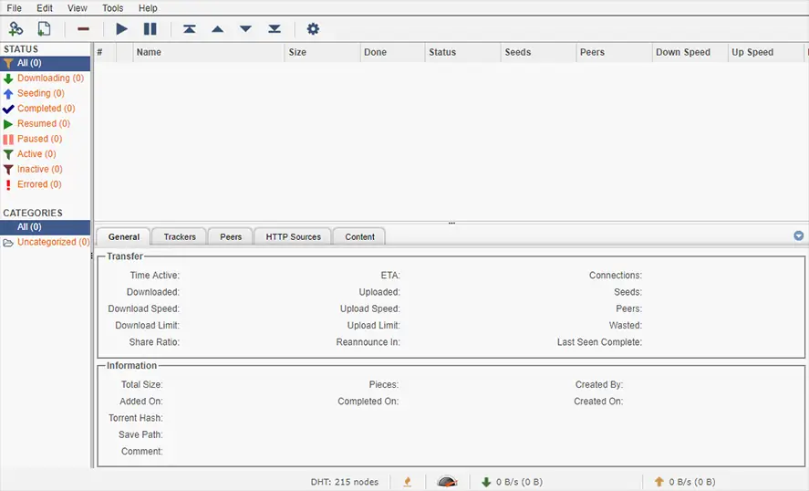

# Saffron

## (S)erver (A)s a (F)ile (F)older (R)unning (O)n (N)etwork

...the second half is a backcronym

### Saffron is a docker compose implementation of a server deployable via (almost entirely) static files

[Why Saffron?](https://ivylikethevine.com/projects/saffron)

I built saffron because I wanted a way to utilize docker compose on a homelab server with easy SVM, configurability, and simple setup.

#### To deploy

Prerequisites: git, docker, docker compose, avahi-daemon (optional but recommended)

```bash
ssh <hostname>.local # assuming avahi-daemon is running on server, otherwise use the host IP
git clone git@github.com:ivylikethevine/saffron.git
sudo ./create_folder.sh DATA_DIR # create file folders & DATA_DIR, such as /data, or /mnt/driveName
cd saffron/dockge
docker compose up -d
```

then visit localhost:5001 or \<hostname\>.local:5001 to start and stop individual stacks via the [Dockge](https://github.com/louislam/dockge) interface. Dockge is a Web UI to manage & control docker containers. As opposed to portainer, the user maintains direct and full control of the compose yaml files.

### Important Paths

1. `/containers/` - stores individual generated configs, db files, etc.
    - This is not a perfect separation, since some containers will use config for "data" (such as torrent clients using it as a default download location)
2. `/home/$USER/saffron` - saffron root `/dockge` - dockge, `/stacks` - all other stacks/services
3. `$DATA_DIR` - where bulk files are stored (documents, photos, media, etc.) per stack. 
    - `.env` files are not (currently) shared between any stacks, so each `.env` must define `DATA_DIR` per stack

## v0.15 List of Stacks & Services

** Names are lowercased per dockge stack naming requirements

&#x2705;: Tested

&#128679;: Active development

* &#128679; [avahi](https://github.com/flungo-docker/avahi) - Allows docker containers to access mdns on LAN.
  * <details>
      <!-- <h3>WebUI Dashboard</h3> -->
      <!--  -->
    </details>

* &#128679; [crafty](https://docs.craftycontrol.com/pages/getting-started/installation/docker/) - Easily deploy/manage minecraft servers.
  * <details>
      <!-- <h3>WebUI Dashboard</h3> -->
      <!--  -->
    </details>

* &#128679; [dokemon](https://dokemon.dev/) - Web UI to manage docker containers/view logs/etc.
  * <details>
      <!-- <h3>WebUI Dashboard</h3> -->
      <!--  -->
    </details>

* &#x2705; [dockge](https://github.com/louislam/dockge) - Web UI to manage docker compose files (integral to `saffron`).
  * <details>
      <h3>WebUI Dashboard</h3>
      
    </details>

* &#x2705; [duplicati](https://docs.linuxserver.io/images/docker-duplicati/) - Automated backup to AWS/Backblaze/etc.
  * <details>
      <h3>WebUI Dashboard</h3>
      
      
      <a href="https://ivylikethevine.com/projects/homelab-backups/#rule-3-offsite-backups"> Example implementation on my blog.</a>
    </details>

* &#128679; [handbrake](https://handbrake.fr/) - Web UI for transcoding video/audio files.
  * <details>
      <!-- <h3>WebUI Dashboard</h3> -->
      <!--  -->
    </details>

* &#x2705; [heimdall](https://docs.linuxserver.io/images/docker-heimdall/) - Easy to use home page.
  * <details>
      <h3>WebUI Dashboard</h3>
      
    </details>

* &#x2705; [homeassistant](https://www.home-assistant.io/installation/linux#docker-compose) - Smart home automation.
  * <details>
      <h3>WebUI Dashboard</h3>
      
    </details>

* media-clients - Various media streaming services with a preconfigured <a href="https://github.com/ivylikethevine/saffron/blob/main/stacks/media-clients/.env.public"><code>.env.public</code></a>.

  * &#x2705; [jellyfin](https://docs.linuxserver.io/images/docker-jellyfin/) - Tv/movie streaming.
    * <details>
        <h3>WebUI Dashboard</h3>
        
      </details>

  * &#x2705; [jellyseer](https://hub.docker.com/r/fallenbagel/jellyseerr) - Tv/movie requests.
    * <details>
        <h3>WebUI Dashboard</h3>
        
      </details>

  * &#x2705; [kavita](https://github.com/Kareadita/Kavita) - Ebook reader.
    * <details>
        <h3>WebUI Dashboard</h3>
        
      </details>

  * &#x2705; [navidrome](https://github.com/navidrome/navidrome/) - Music streaming service (implements [subsonic](https://www.subsonic.org/pages/features.jsp) for compatibility with other services).
    * <details>
        <h3>WebUI Dashboard</h3>
        
      </details>

  * &#x2705; [audiobookshelf](https://github.com/advplyr/audiobookshelf) - Audiobook streaming.
    * <details>
        <h3>WebUI Dashboard</h3>
        
      </details>

* &#x2705; [midarr](https://github.com/midarrlabs/midarr-server) - Simple, lightweight media server directly integrated with sonarr & radarr.
  * <details>
      <h3>WebUI Dashboard</h3>
      
    </details>

* &#x2705; [netboot](https://docs.linuxserver.io/images/docker-netbootxyz/) - PXE boot system.
  * <details>
      <h3>WebUI Dashboard</h3>
      
    </details>

* &#x2705; [netdata](https://learn.netdata.cloud/docs/installing/docker) - Hardware usage/monitoring (incl. containers).
  * <details>
      <h3>WebUI Dashboard</h3> 
      
    </details>

* &#128679; [octoprint](https://github.com/OctoPrint/octoprint-docker) - 3D printer automation/monitoring
  * <details>
      <h3>WebUI Dashboard</h3>
      
    </details>

* torrent - Full torrenting suite with a preconfigured <a href="https://github.com/ivylikethevine/saffron/blob/main/stacks/media-clients/.env.public"><code>.env.public</code></a>.
  
  * &#x2705; [qbittorrentvpn](https://github.com/MarkusMcNugen/docker-qBittorrentvpn) - torrent client that runs only on VPN connection
    * <details>
        <h3>WebUI Dashboard</h3>
        

        <h4>
          <a href="https://github.com/MarkusMcNugen/docker-qBittorrentvpn?tab=readme-ov-file#environment-variables">Documentation on Environment Variables</a>
        </h4>
      </details>
  
  * &#x2705; [prowlarr](https://docs.linuxserver.io/images/docker-prowlarr/) - search aggregator
    * <details>
        <h3>WebUI Dashboard</h3>
        
      </details>
  
  * &#x2705; [flaresolverr](https://github.com/FlareSolverr/FlareSolverr) - search proxy (required for some search engines)
    * <details>
      <!-- <h3>WebUI Dashboard</h3> -->
      <!--  -->
    </details>

* [servarr](https://wiki.servarr.com/docker-guide) - Media library system(s) with a preconfigured <a href="https://github.com/ivylikethevine/saffron/blob/main/stacks/servarr/.env.public"><code>.env.public</code></a>.

  * &#x2705; [sonarr](https://docs.linuxserver.io/images/docker-sonarr/) - TV library manager.
    * <details>
        <h3>WebUI Dashboard</h3>
        
      </details>

  * &#x2705; [radarr](https://docs.linuxserver.io/images/docker-radarr/) - Movie library manager.
    * <details>
        <h3>WebUI Dashboard</h3>
        
      </details>

  * &#x2705; [lidarr](https://docs.linuxserver.io/images/docker-lidarr/) - Music library manager.
    * <details>
        <h3>WebUI Dashboard</h3>
        
      </details>

  * &#x2705; [readarr](https://docs.linuxserver.io/images/docker-readarr/) - Ebook library manager.
    * <details>
        <h3>WebUI Dashboard</h3>
        
      </details>

  * &#x2705; [bazarr](https://docs.linuxserver.io/images/docker-bazarr/) - Subtitle management/requests for sonarr/radarr.
    * <details>
        <h3>WebUI Dashboard</h3>
        
      </details>

* &#x2705; [speedtest-tracker](https://github.com/alexjustesen/speedtest-tracker) - Internet speed monitoring.
    * <details>
        <h3>WebUI Dashboard</h3>
        
      </details>

* &#128679; [thelounge](https://github.com/thelounge/thelounge-docker) - IRC client.
  * <details>
      <!-- <h3>WebUI Dashboard</h3> -->
      <!--  -->
    </details>

* &#128679; [traefik](https://hub.docker.com/_/traefik) - Reverse proxy with easy docker integration.
  * <details>
      <!-- <h3>WebUI Dashboard</h3> -->
      <!--  -->
    </details>

* &#128679; [uptime-kuma](https://github.com/louislam/uptime-kuma) - Nice health checking tool with simple UI (same dev as Dockge!).
  * <details>
      <!-- <h3>WebUI Dashboard</h3> -->
      <!--  -->
    </details>

* &#x2705; [watchtower](https://github.com/containrrr/watchtower) - Automatically update & restart docker containers.
  * <details>
      <!-- <h3>WebUI Dashboard</h3> -->
      <!--  -->
    </details>
If a service isn't on here yet, feel free to add it! Most of these are very simple applications of the excellent [linuxserver docker images](https://docs.linuxserver.io/images/). When using those, an example .env.public would be as follows

```bash
## Defaults
PGID=1000
PUID=1000
# The PGID/PUID are required in the .env(s), user: 1000:1000 in docker compose does not play well with these images.
UMASK=022
# Relatively safe file permission for containers.
```

I've also made stacks using Lissy93's well maintained [portainer template repo](https://github.com/Lissy93/portainer-templates), although this is slightly different than working from raw compose files.

### Compatible with

* [obico](https://www.obico.io/docs/server-guides/install/) - 3D print failure detection notification/stopping
  * To install:
    `cd /home/${USER}/saffron/stacks && git clone -b release https://github.com/TheSpaghettiDetective/obico-server.git && cd obico-server && docker compose up -d`

* For other projects that use a docker compose file from locally build Dockerfiles, clone the repo into `/home/${USER}/saffron/stacks`, then add `stacks/repoName/` to the `.gitignore` file. An alternative is to use either the `p-` or `dev-` prefix in the stack name to be ignored by git. See [editing .gitignore](https://git-scm.com/book/en/v2/Git-Basics-Recording-Changes-to-the-Repository#_ignoring) for more information.

#### Easy docker install

`curl -fsSL https://get.docker.com -o get-docker.sh && sudo sh ./get-docker.sh`

** Note: If installing on Linux Mint, `$VERSION_CODENAME` needs to be replaced with `$UBUNTU_CODENAME` for the apt sources to be correct

#### Docker Volumes

When editing the DATA_DIR(s), it is often best to have the last part of the host volume match the container volume, such as:

* `/data/television/:/local/library/television` -> Intuitive
* `/data/tv/:/local/library/television` -> Often confusing (at least for me!)

I have `DATA_DIR`, `DATA_DIR_EXTRA`, and `BULK_DIR`, but only `DATA_DIR` is required. The others can be deleted from compose files.

#### Migration Tools

* [composerize](https://github.com/composerize/composerize) - to turn `docker run...` into docker compose yaml (though dockge does have an implementation of this in the UI)
* [decomposerize](https://github.com/composerize/decomposerize) - inverse of above
* [autocompose](https://github.com/Red5d/docker-autocompose) - to turn running containers into docker compose yaml

##### Useful Bash Commands

###### Fix File Owner

Quick & dirty fix for fixing file/folder ownership: `sudo chown -R 1000:1000 /containers`

The 1000:1000 is (almost always) an alias for the default Linux user.

###### Fix File Permissions

Quick & dirty fix for fixing file/folder permissions: `sudo chmod -R 755 /containers`

##### Internal Routing

For configuring docker containers that talk to each other, you can replace `localhost` with the `container_name` of the service to network, as long as both are inside of the same `compose.yaml`. For example, connecting prowlarr & sonarr, you can use `prowlarr:9696` and `sonarr:8989`. If the containers are not in the same stack, this will require a bridge connection. An example of a bridge is included in `servarr` and `torrent`. To connect to `servarr` from `torrent`, `qbittorrentvpn` must use the `servarr_bridge` network.

##### Env Files

This project has two types of `.env` files:

1. `.env` - this type is natively loaded by dockge, allowing for Web UI editing + templating for paths. This is the place that VPN credentials, etc. should be stored since they will not be committed.
    * if stacks throw errors about undefined variables, make sure to define those variables in the `.env` for that stack.
    * these files are ignored by git, so they can locally hold some credentials (such as VPN logins) + personal folder routing
2. `.env.public` - this holds basic preconfigurations for each container to work and should be changed with caution. They are not available in the Dockge Web UI.


###### Planned Features

1. Automatic traefik routing of containers using docker integration.
1. Install script for folder permissions.
1. Git submodules

#### To-Do

* Test multi-node support
* Test easy docker install on linux mint
* DNS description (avahi, .local, mdns)
* Services:
  * Adguard
  * Ansible
  * Mail server
  * Cloudflare
  * Nextcloud

###### Creating a Saffron-Styled compose from Scratch

Saffron is designed to be extensible. It is more an amalgamation of my experience than a specific software suite. As such, here is a compilation of my advice when creating new docker compose files for use with saffron or similar deployments.

1. Only edit in one mode at a time - Implemented in this repository is a vscode server, which allows for editing of files that dockge does not display in the UI (such as `.env.public`, `.gitignore`, and the dockge `compose.yaml`). Using dockge to edit some files & vscode to edit others can often result in mismatches and confusion. For any operation, pick one tool and use that until you can fully transition to the other tool.
2. Consistent naming - In the homelab space, some of the more advanced features of docker are not as useful and often lead to confusion. Here is an example format for a compose file, with explanations. Also, [here is the compose documentation](https://docs.docker.com/compose/compose-file/05-services/).

```bash
version: 3
services:
  vscode-server: 
    # "vscode-server" is the name of our service.
    restart: unless-stopped 
    # Always remember to define a restart policy. 
    container_name: vscode-server 
    # Usually easiest to keep as exact duplicate of service name.
    image: linuxserver/code-server 
    # Typically, the service name would be derived from the image name (the part after the "/"). Here, it is different to be easier for human readability since "code-server" is quite vague.
    ports:
      - 8445:8443 
      # The port assignments in saffron are designed to avoid conflicts. host:container is the format, and it is easiest to change host mapping by itself, and not to mess with default port mappings. Some containers require environment variables to change the internal port, so its best to avoid.
    environment:
      - PUID=1000 
      - PGID=1000
      # Most of the time, we want our containers to have the default user permissions (1000:1000 user:group)
    env_file:
      - .env.public 
      # Alternatively to the environment tag, we can load a .env file directly. The above PUID/PGID could be moved to .env.public for conciseness. 
    volumes:
      - /containers/vscode-server/config:/config 
      # Again, usually easiest to follow /containers/container_name/folder:/folder for consistency & clarity.
      - /etc/timezone:/etc/timezone:ro 
      # This will set our TZ to the host's TZ, instead of configuring per container. To change, run `dpkg-reconfigure tzdata` on the host.
networks: {}
```
### It is also easiest to name the stack the same as the main service in the compose file. 
** (Adding the 'p-' or 'dev-' prefix will ignore the stack in git)


3. Keep secrets in `.env` and double check your commits! An alternative option is [docker secrets](https://docs.docker.com/compose/use-secrets/), but same rules apply. Make sure your commits never contain private keys, etc.
