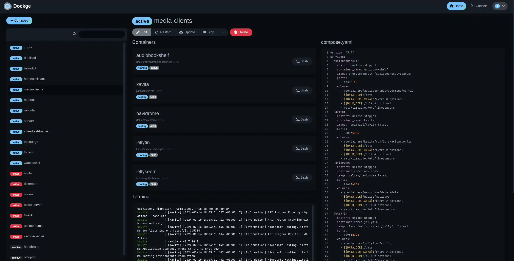

# Dockge

Web UI for managing and updating docker-compose stacks. The control center for Saffron.

<https://github.com/louislam/dockge>

<https://hub.docker.com/r/louislam/dockge>

## Why Dockge?

- Edits compose files directly (you always have source control)
- Lightweight and simple
- No database required

## Architecture Compatibility


## WebUI Dashboard



## Key Features

- **Stack Management:** Start/stop/restart individual stacks
- **Compose Editor:** Edit YAML directly in the UI
- **Logs Viewer:** See container output in real-time
- **Auto-compose:** Convert `docker run` commands to compose (built-in)
- **Template Support:** Templating for environment variables

## Access

- **URL:** `http://localhost:5001` (or `http://<hostname>.local:5001`)

## Usage

1. **Add a stack:** Click "Add Stack" → point to a stacks/ directory
2. **Edit compose file:** Click the pencil icon to edit YAML
3. **Deploy:** Click "Deploy" or use individual start/stop buttons
4. **View logs:** Click the stack name, then "View Logs"

## Stacks Directory

Dockge reads from the `DOCKGE_STACKS_DIR` environment variable (set in root `compose.yaml`):

```sh
/home/$USER/saffron/stacks/
```

Each subdirectory (servarr/, torrent/, etc.) becomes a separate "stack" in the UI.

### `compose.yaml`

[filename](compose.yaml ':include :type=code')
