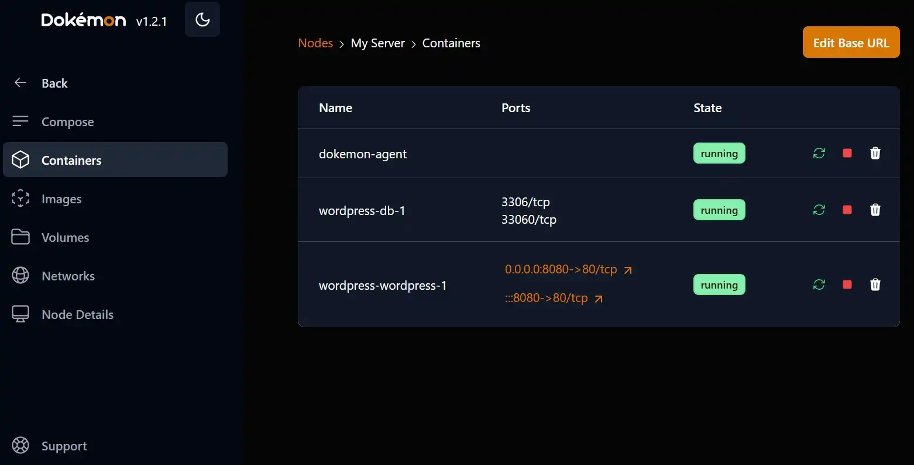

[Back to main README.md](../../README.md)

# Dokemon

Web UI to manage docker containers/view logs/etc.

<https://dokemon.dev/>

<https://github.com/productiveops/dokemon>

<https://hub.docker.com/r/productiveops/dokemon>

## Architecture Compatibility

 

### WebUI Dashboard

