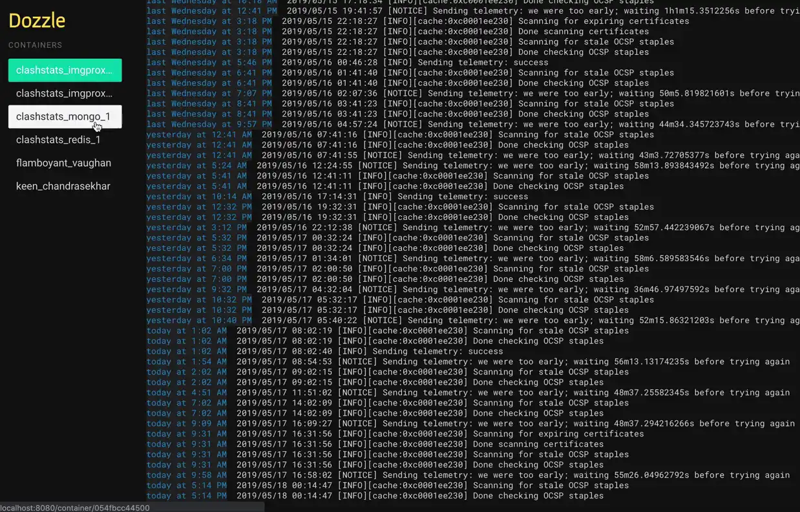

# Dozzle

Web UI to live docker container logs.

<https://dozzle.dev/>

<https://github.com/amir20/dozzle>

<https://hub.docker.com/r/amir20/dozzle>

## Architecture Compatibility

 

### WebUI Dashboard

#### `compose.yaml`

[filename](compose.yaml ':include :type=code')