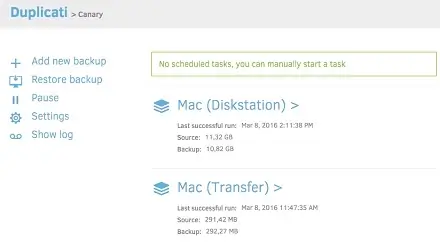

# Duplicati

<https://docs.linuxserver.io/images/docker-duplicati/>

# Architecture Compatibility

 

### WebUI Dashboard

Example implementation on [my blog](https://ivylikethevine.com/projects/homelab-backups/#rule-3-offsite-backups)
