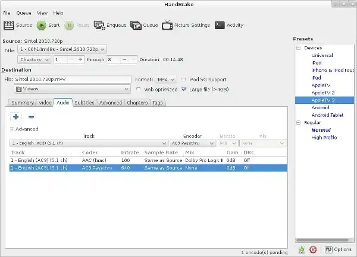

# Handbrake

Web UI for transcoding video/audio files.

<https://handbrake.fr/>

<https://github.com/jlesage/docker-handbrake>

<https://hub.docker.com/r/jlesage/handbrake>

# Architecture Compatibility

 

### WebUI Dashboard

