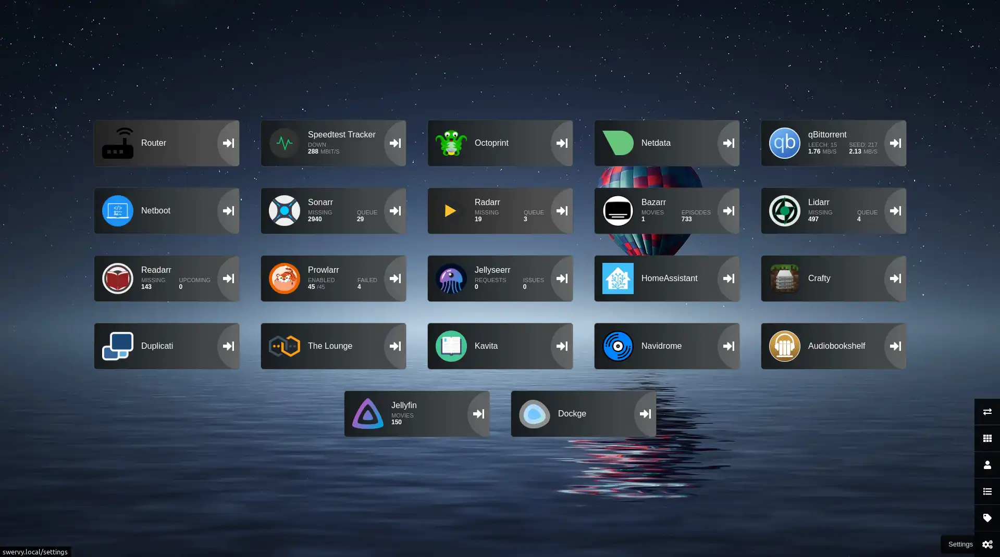

# Heimdall

Easy to use home page.

<https://heimdall.site/>

<https://docs.linuxserver.io/images/docker-heimdall/>

<https://github.com/linuxserver/docker-heimdall>

<https://hub.docker.com/r/linuxserver/heimdall>

## Architecture Compatibility

 

### WebUI Dashboard

[filename](compose.yaml ':include :type=code')