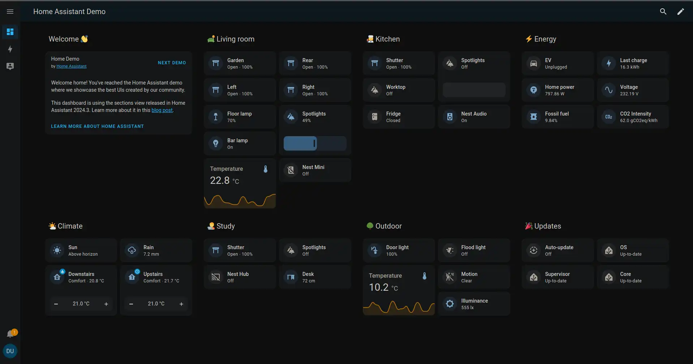

[Back to main README.md](../../README.md)

# Homeassistant

Smart home automation.

<https://www.home-assistant.io/installation/linux#docker-compose>

# Architecture Compatibility

 

### WebUI Dashboard

