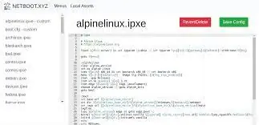

[Back to main README.md](../../README.md)

# Netboot

PXE boot system.

<https://netboot.xyz/>

<https://docs.linuxserver.io/images/docker-netbootxyz/>

<https://github.com/linuxserver/docker-netbootxyz>

<https://hub.docker.com/r/linuxserver/netbootxyz>

## Architecture Compatibility

 

### WebUI Dashboard

