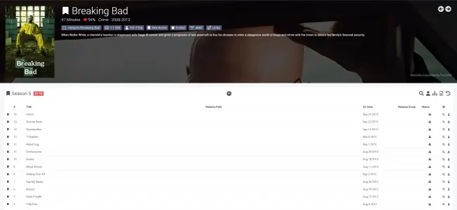
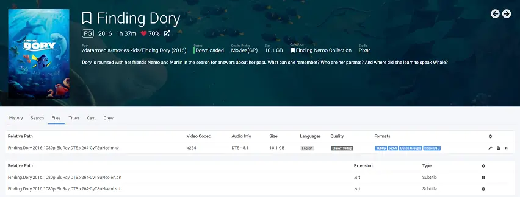
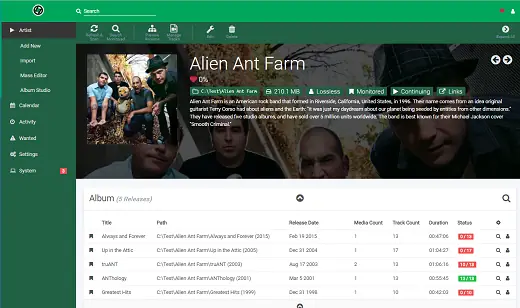
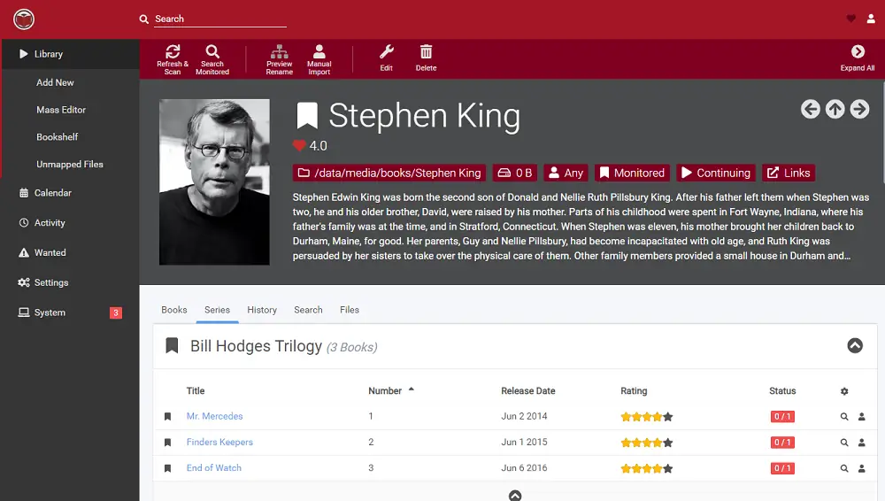
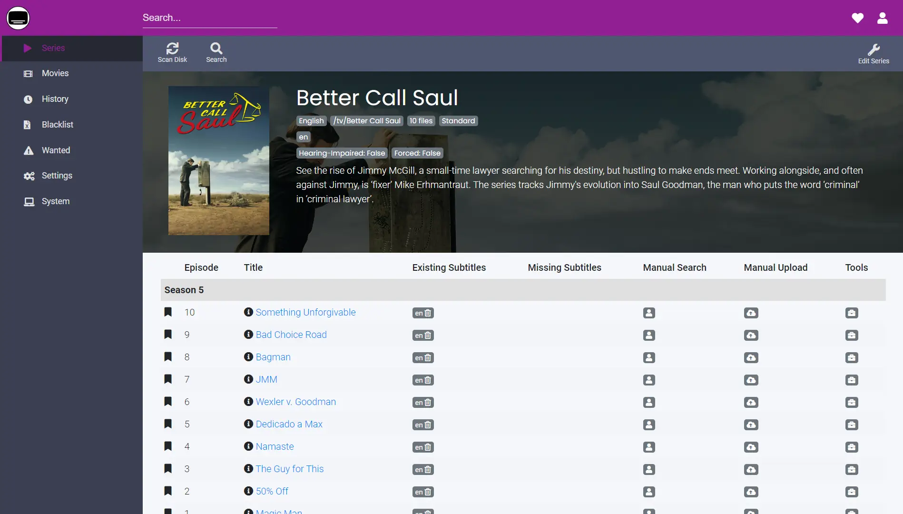

# Servarr

<https://wiki.servarr.com/docker-guide>

# Sonarr

<https://docs.linuxserver.io/images/docker-sonarr/>

## Architecture Compatibility

 

### WebUI Dashboard

# Radarr

<https://docs.linuxserver.io/images/docker-radarr/>

## Architecture Compatibility

 

### WebUI Dashboard

# Lidarr

<https://docs.linuxserver.io/images/docker-lidarr/>

## Architecture Compatibility

 

### WebUI Dashboard

# Readarr

<https://docs.linuxserver.io/images/docker-readarr/>

## Architecture Compatibility

 

### WebUI Dashboard

 -### WebUI Dashboard

# Bazarr

<https://docs.linuxserver.io/images/docker-bazarr/>

## Architecture Compatibility

 

### WebUI Dashboard

