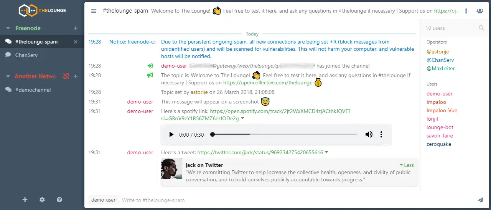

# Thelounge

<https://github.com/thelounge>

<https://thelounge.chat/docs>

<https://github.com/thelounge/thelounge-docker>

<https://hub.docker.com/r/thelounge/thelounge>

## Architecture Compatibility

 

### WebUI Dashboard

