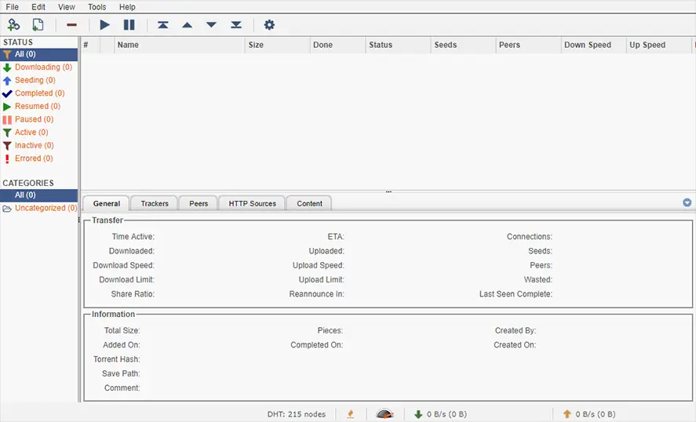
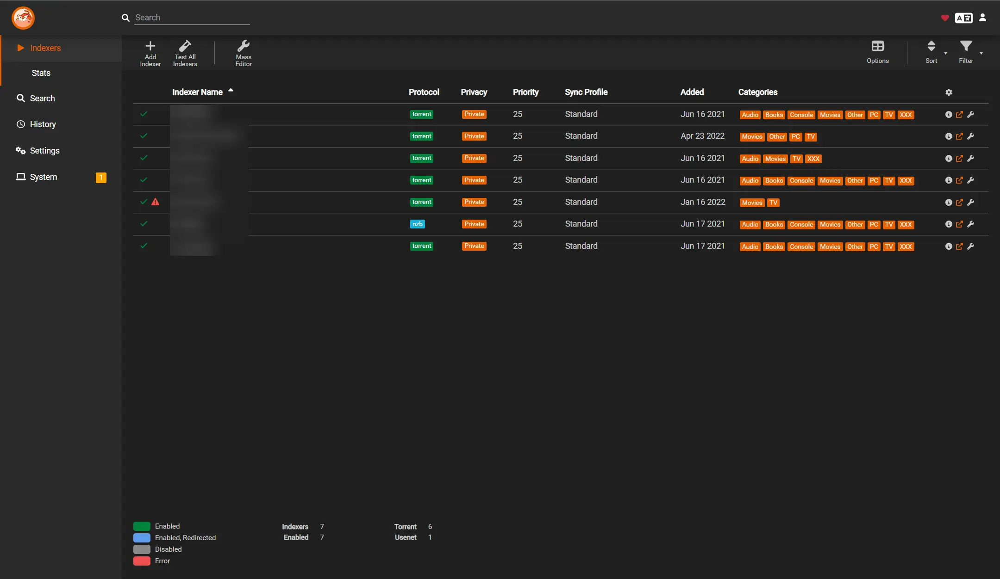

# Torrent

# Qbittorrentvpn

<https://github.com/markusmcnugen/docker-qbittorrentvpn>

## Architecture Compatibility

 

### WebUI Dashboard

#### [Documentation on Environment Variables](https://github.com/markusmcnugen/docker-qbittorrentvpn?tab=readme-ov-file#environment-variables)

# Prowlarr

<https://docs.linuxserver.io/images/docker-prowlarr/>

## Architecture Compatibility

 

### WebUI Dashboard

# Flaresolverr

<https://github.com/flaresolverr/flaresolverr>

## Architecture Compatibility

 
