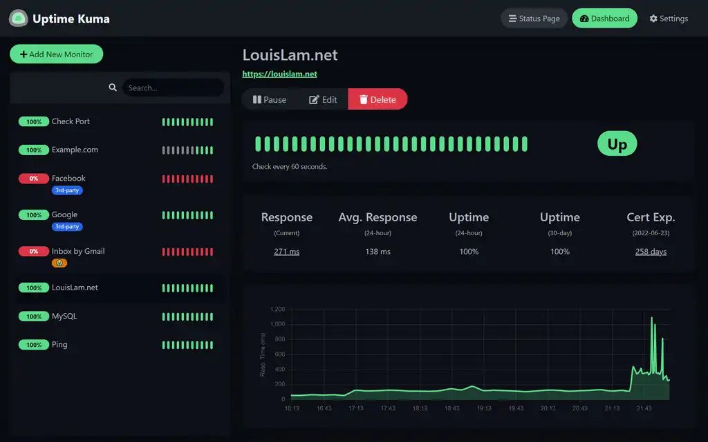

# Uptime-kuma

Nice health checking tool with simple UI (same dev as Dockge!).

<https://github.com/louislam/uptime-kuma>

<https://hub.docker.com/r/louislam/uptime-kuma>

## Architecture Compatibility

 

### WebUI Dashboard

[filename](compose.yaml ':include :type=code')