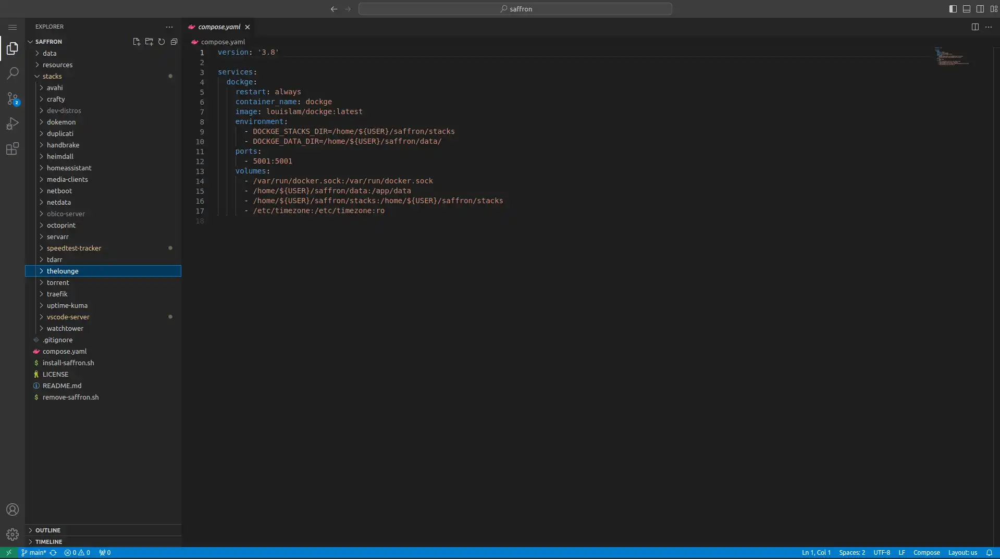

# Vscode-server

VSCode running with a Web UI (for editing saffron config files, etc.).

<https://github.com/coder/code-server>

<https://github.com/linuxserver/docker-code-server>

<https://docs.linuxserver.io/images/docker-code-server/>

<https://hub.docker.com/r/linuxserver/code-server>

## Architecture Compatibility

 

### WebUI Dashboard

#### Docker Mods

##### Linuxserver has a great list of docker mods for [vscode-server](https://mods.linuxserver.io/?mod=code-server), allowing various tools and runtimes to be added.

[filename](compose.yaml ':include :type=code')